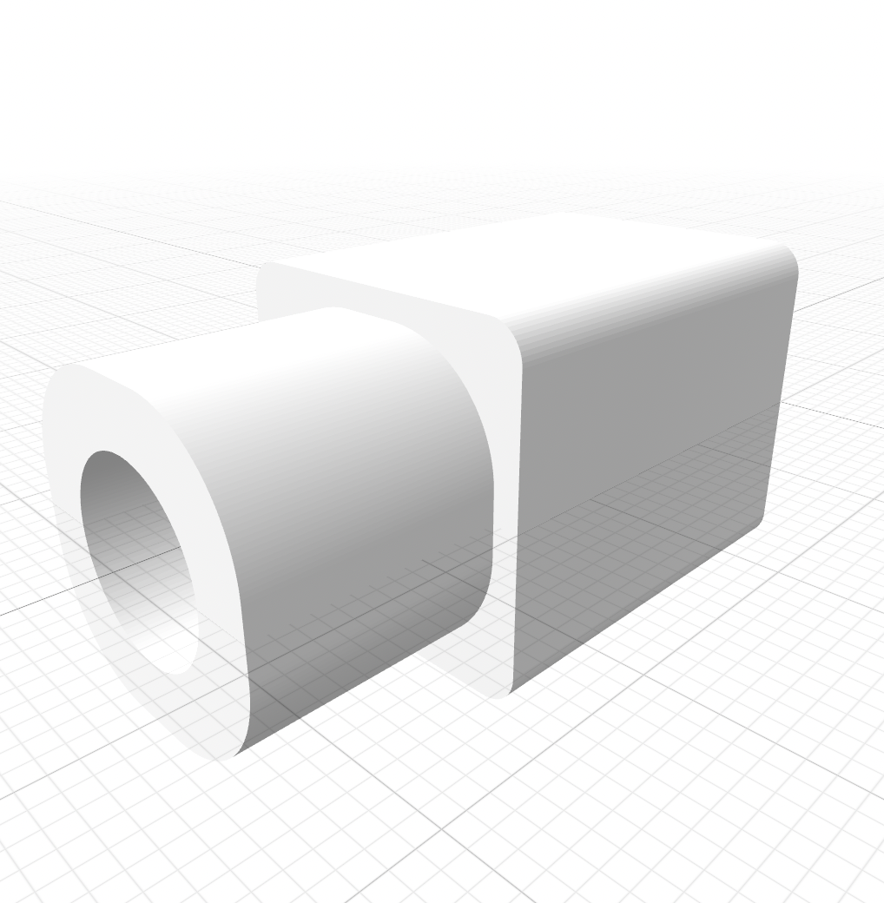
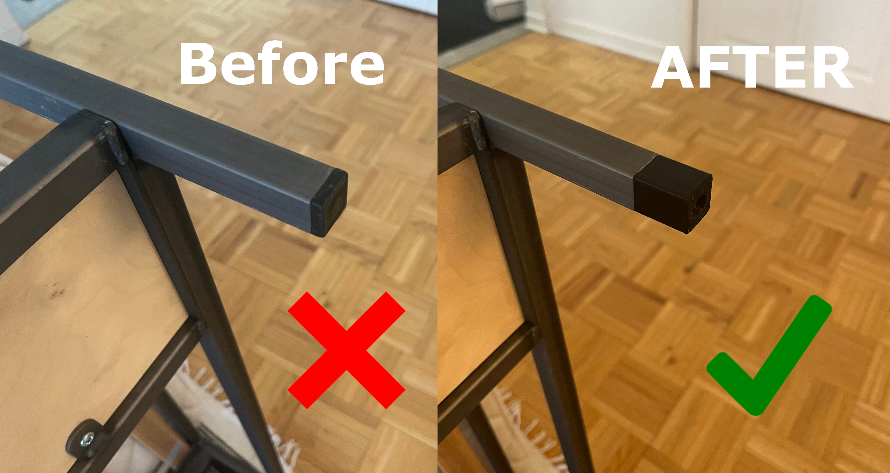
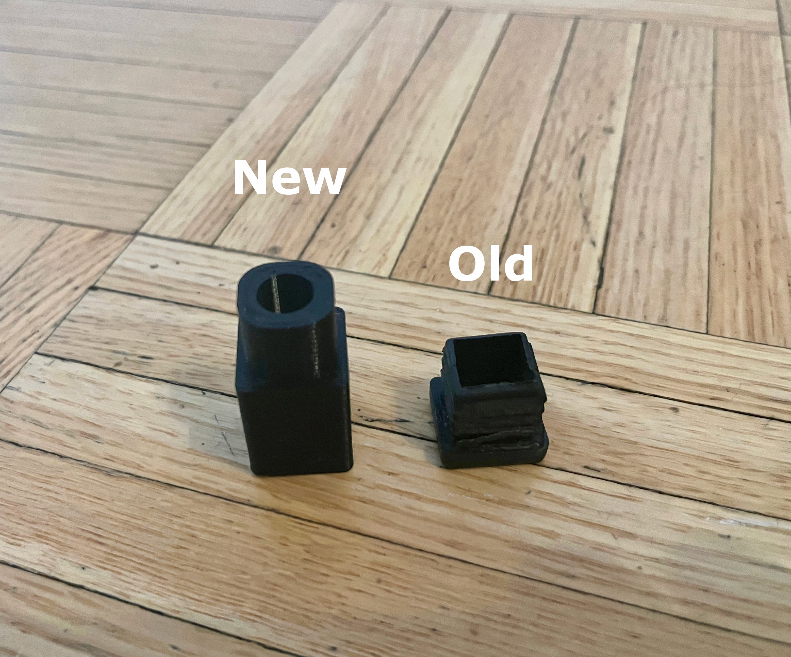

# 3D Printing - Square Tubing Extension

## Description
This is a [OpenSCAD](https://openscad.org/) project that produces a 3D model for a square tubing extension. The stl file is used for 3D printing.

This project can be found on thingiverse:  
[thingiverse - square_tubing_holder](https://www.thingiverse.com/thing:6297035)

## Instructions
For changing the design to have different dimensions you will need [OpenSCAD](https://openscad.org/). Open the file named 'square_tubing_extension.scad' with OpenSCAD. On lines 8-10, change the values of the variables to your desire. These variables are currently setup for 20mm square tubing. Export the new .stl file to use in your 3D prints. For a snug fit into the tubing a piece of tape can be used around the piece insert.

This project was used to raise the height of an [IKEA sofa EKEBOL](https://www.ikea.com/pt/pt/assembly_instructions/ekebol-three-seat-sofa-katorp-natural__AA-1951048-2_pub.pdf)

## Developer / Author
Jason Fleischer    
[https://jasonfleischer.github.io/website/](https://jasonfleischer.github.io/website/)  

Support the Developer  
[https://ko-fi.com/jasonfleischer](https://ko-fi.com/jasonfleischer)

## Images

